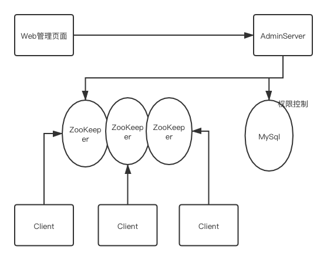

## 配置中心

 

## 接入前提

- 使用 MySQL 做权限校验，同时使用了 Redis。本地启动时需提前安装好以上中间件。

- 配置中心基于 zookeeper 来设计，需提前搭建好 zk 集群。

- 配置中心管理后台前后端分离，分别对应 **config-center-ui** 和 **config-center-admin**

## Client 端接入方式

1. 引入 maven 依赖
    ```xml
        <dependency>
           <groupId>com.github.mjd507</groupId>
           <artifactId>config-center-client</artifactId>
           <version>1.0-SNAPSHOT</version>
        </dependency>
    ```
   
2. 配置zk链接信息
    resources 目录下需创建 META-INF 目录，在里面创建 app.properties 文件，添加 app.name 内容
    app.name 对应的内容即为 zk 对此项目的配置内容前缀，每个项目唯一
    ```yaml
    configcenter:
      connect-string: localhost:2181 # 多个地址用,分割
    ```

3. 配置客户端
    ```java
    @Configuration
    @Getter
    @Setter
    public class CuratorConfig {
    
        @Value("${configcenter.connect-string}")
        private String connectString;
    
        @Value("${configcenter.is-admin}")
        private Boolean isAdmin;
    
        @Bean(name = "curatorManager", destroyMethod = "close")
        public CuratorManager curatorManager() {
            CuratorManager curatorManager = new CuratorManager();
            curatorManager.setNameSpace(ResourceUtil.getAppName());
            curatorManager.setIsAdmin(isAdmin);
            curatorManager.setConnectString(connectString);
            curatorManager.init();
            return curatorManager;
        }
    }
    ```
   
4. 注入 CuratorManager，读取配置，监听单个key
    ```java
       @Autowired
       private CuratorManager configManager;
   
       configManager.getAll();
       configManager.get(String key);

        String watchKey = "key1";
        configManager.registerConfigChangeListener(new ConfigChangeListener(watchKey) {
            @Override
            public void onConfigChange(Object newVal) {
                log.info("监听到配置改变，key: {}, val:{}", watchKey, newVal);
            }
        });
    ```
 